# LibreCAD的学习

### 应用主界面

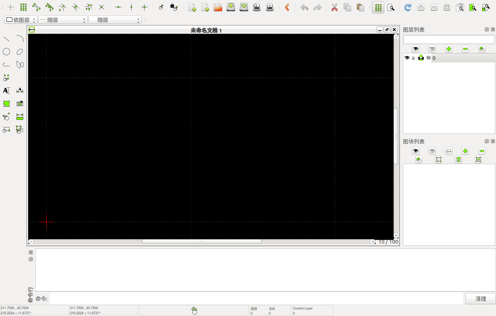

### 横向工具条

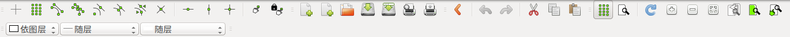

线的颜色、粗细、线形

### 左侧工具箱

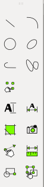

直线、弧线、圆形、椭圆、多义线、样条线、

点

文字、尺寸、填充、插入图像、修改、信息、创建图块、选择

### 右侧图层列表

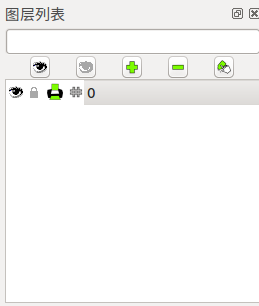

### 右侧图块列表

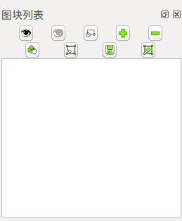

### 底部命令行

### 底部状态栏

直线工具箱

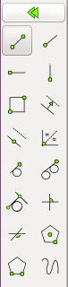

圆弧工具箱

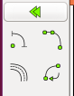

圆形工具箱

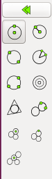

椭圆工具箱

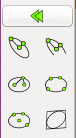

多义线工具箱

样条曲线工具箱

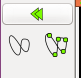

尺寸标注工具箱

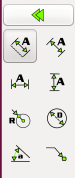

填充

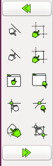

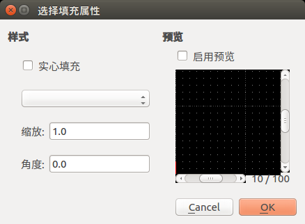

插入图像

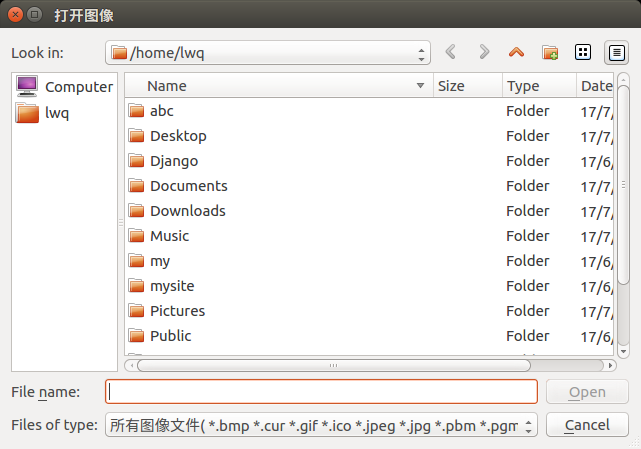

修改

信息

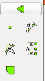

选择

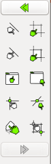

菜单

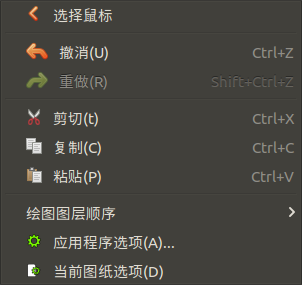

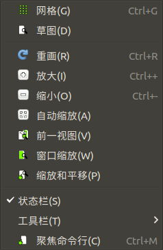

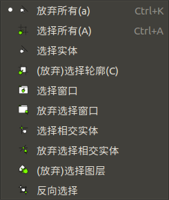

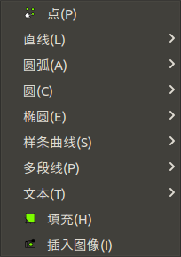

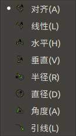

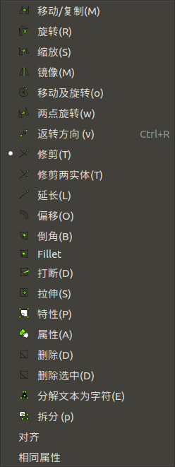

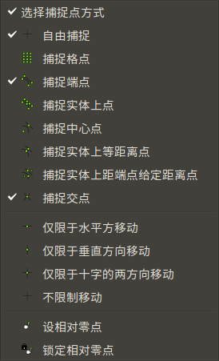

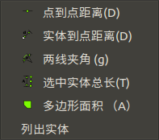

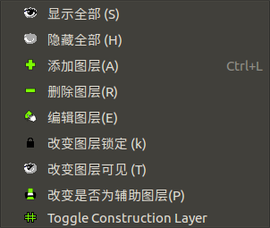

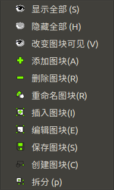

图纸选项

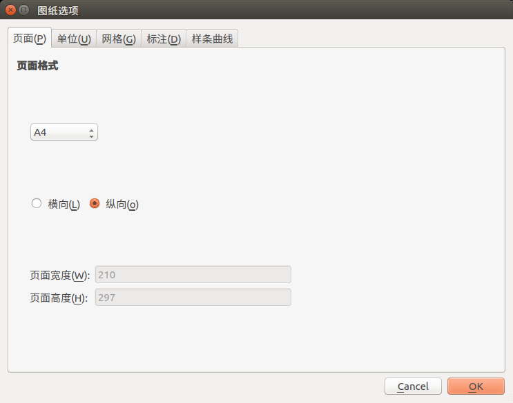

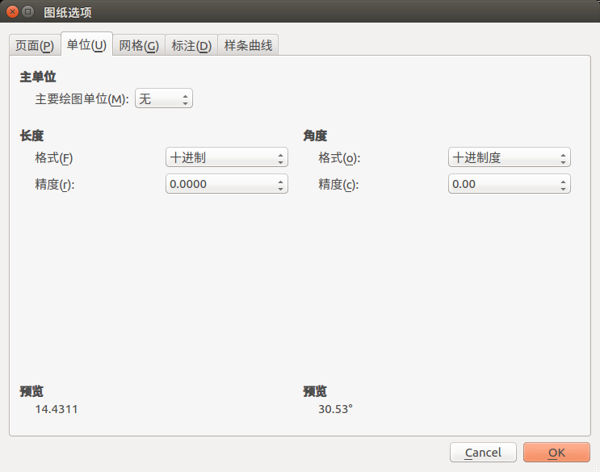

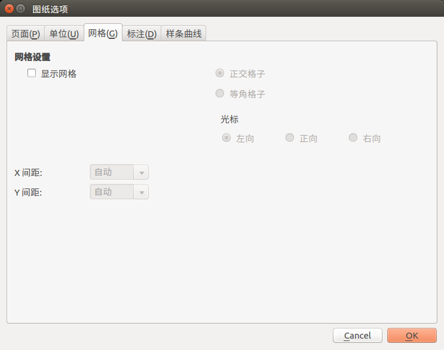

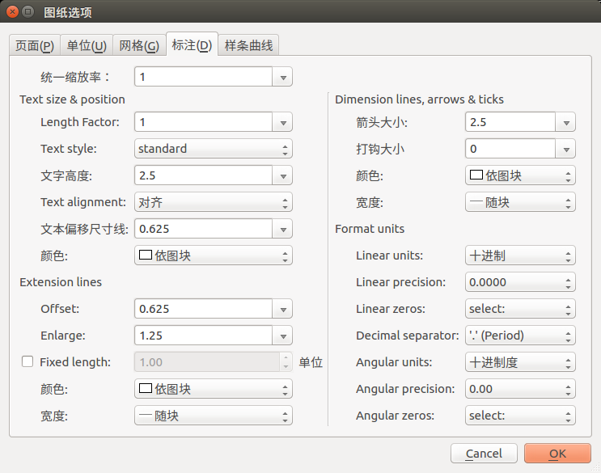

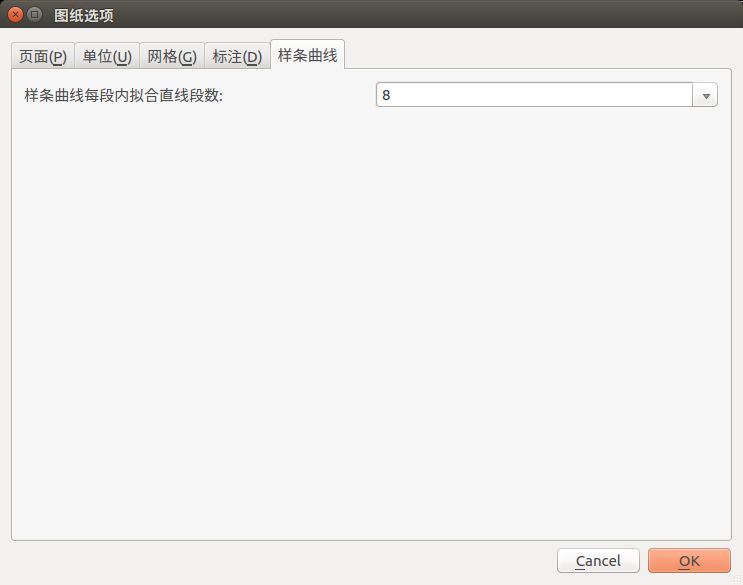

应用程序选项

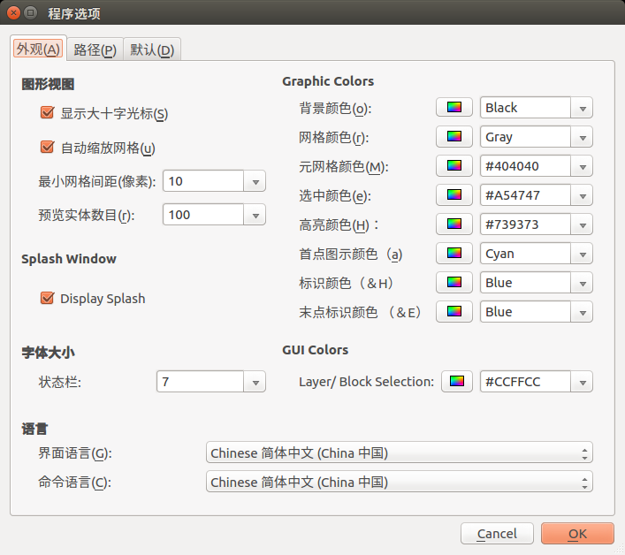

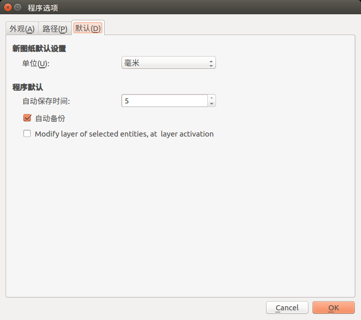

菜单-工具栏

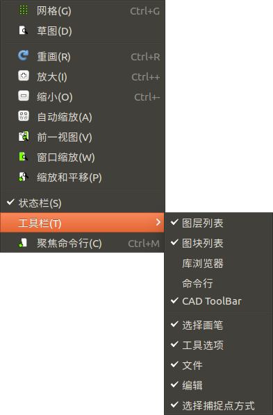

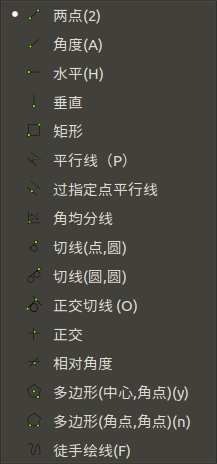

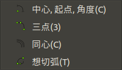

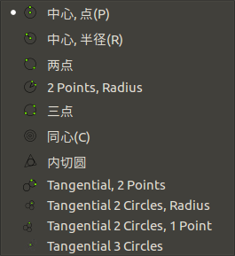

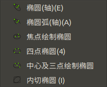

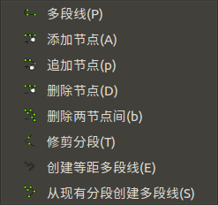

