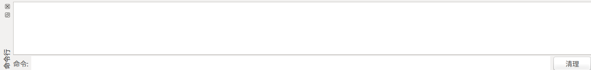
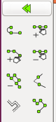
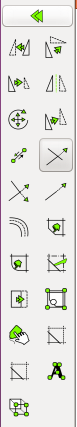
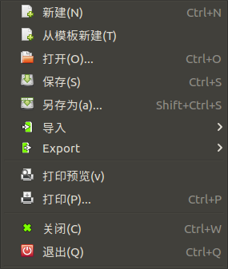
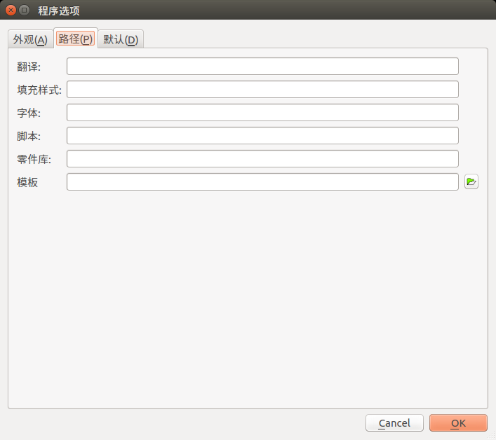

# LibreCAD的学习

### 应用主界面

### 横向工具条

线的颜色、粗细、线形

### 左侧工具箱

直线、弧线、圆形、椭圆、多义线、样条线、

点

文字、尺寸、填充、插入图像、修改、信息、创建图块、选择

### 右侧图层列表

### 右侧图块列表

### 底部命令行

### 底部状态栏

直线工具箱

圆弧工具箱

圆形工具箱

椭圆工具箱

多义线工具箱

样条曲线工具箱

尺寸标注工具箱

填充

插入图像

修改

信息

选择

菜单

图纸选项

应用程序选项

菜单-工具栏

